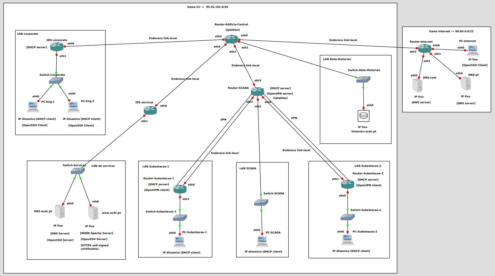
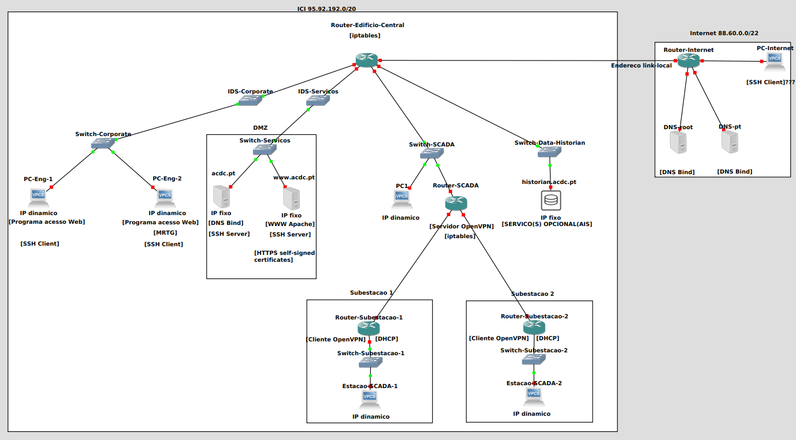

# Relatório do projeto de SIRS

Segurança Informática em Redes e Sistemas 2020-2021, segundo semestre

## Autores

*(limite: 1500 palavras)*

**Grupo 6**

  

| Número | Nome              | Correio eletrónico                                      |
| -------|-------------------|---------------------------------------------------------|
| 93583  | Henrique Candeias | <mailto:henrique.a.candeias@tecnico.ulisboa.pt>         |
| 93586  | João Rodrigues    | <mailto:joao.pedro.freixo.rodrigues@tecnico.ulisboa.pt> |
| 93602  | Miguel Gonçalves  | <mailto:migueleduardog2000@tecnico.ulisboa.pt>          |

## Introdução

Este relatório descreve a implementação de uma infraestrutura crítica de informação, com a finalidade de controlar e proteger a rede elétrica de uma região ou país. Para isso, após uma análise cuidada do enunciado, procedemos à elaboração da rede do sistema assim como a atribuição dos devidos endereços. De seguida, procedemos à implementação de diversos serviços para garantir a segurança e o correto funcionamento de todo o sistema.

## Diagrama de rede

Apresentamos, de seguida, os endereços IP atribuídos a cada uma das interfaces (as subredes correspondentes encontram-se de seguida):

| Equipamento             | Interfaces                                    |
| ------------------------|-----------------------------------------------|
| IDS-corporate           | eth0 -> 169.254.2.1                           | 
|                         | eth1 -> 95.92.192.1                           |
| IDS-servicos            | eth0 -> 169.254.3.1                           |
|                         | eth1 -> 95.92.194.1                           |
| Router-Edificio-Central | eth0 -> 169.254.1.1                           |
|                         | eth1 -> 95.92.198.1                           |
|                         | eth2 -> 169.254.4.1                           |
|                         | eth3 -> 169.254.3.2                           |
|                         | eth4 -> 169.254.2.2                           |
| Router-SCADA            | eth0 -> 169.254.6.1                           |
|                         | eth1 -> 95.92.196.1                           |
|                         | eth2 -> 169.254.5.1                           |
|                         | eth3 -> 169.254.4.2                           |
|                         | VPN  -> 95.92.204.1                           |
| Router-Subestacao-1     | eth0 -> 169.254.5.2                           |
|                         | eth1 -> 95.92.200.1                           |
| Router-Subestacao-2     | eth0 -> 95.92.202.1                           |
|                         | eth1 -> 169.254.6.2                           |
| Router-Internet         | eth0 -> 88.60.0.1                             |
|                         | eth1 -> 88.60.2.1                             |
|                         | eth2 -> 88.60.1.1                             |
|                         | eth3 -> 169.254.1.2                           |
| DNS-acdc.pt             | eth0 -> 95.92.194.2                           |
| www.acdc.pt             | eth0 -> 95.92.194.3                           |
| historian.acdc.pt       | eth0 -> 95.92.198.2                           |
| DNS.root                | eth0 -> 88.60.1.2                             |
| DNS.pt                  | eth0 -> 88.60.2.2                             |
| PC-Internet             | eth0 -> 88.60.0.2                             |

Gama de endereços alocado à Internet: 

88.60.0.0/22 dividido em 3 blocos

| Subrede          | Gama de enderecos                      |
| -----------------|----------------------------------------|
| LAN PC-Internet  | 88.60.0.0 - 88.60.0.255 (88.60.0.0/24) | 
| LAN DNS-root     | 88.60.1.0 - 88.60.1.255 (88.60.1.0/24) | 
| LAN DNS-pt       | 88.60.2.0 - 88.60.3.255 (88.60.2.0/23) | 

Gama de endereços alocados à ICI e às subestações:

95.92.192.0/20 dino ponto de vista da VPN, o Router-SCADA é como se fosse um collision domainvidido em 8 blocos

| Subrede            | Gama de enderecos                             |
| -------------------|-----------------------------------------------|
| LAN corporate      | 95.92.192.0 - 95.92.193.255 (95.92.192.0/23)  | 
| LAN de servicos    | 95.92.194.0 - 95.92.195.255 (95.92.194.0/23)  | 
| LAN SCADA          | 95.92.196.0 - 95.92.197.255 (95.92.196.0/23)  |
| LAN Data-Historian | 95.92.198.0 - 95.92.199.255 (95.92.198.0/23)  | 
| LAN Subestacao-1   | 95.92.200.0 - 95.92.201.255 (95.92.200.0/23)  | 
| LAN Subestacao-2   | 95.92.202.0 - 95.92.203.255 (95.92.202.0/23)  |
| LAN VPN            | 95.92.204.0 - 95.92.205.255 (95.92.204.0/23)  | 

        

Gama de endereços alocados às ligações link-local:

| Subrede                                 | Gama de enderecos                             |
| ----------------------------------------|-----------------------------------------------|
| LAN ICI-Internet                        | 169.254.1.0 - 169.254.1.255 (169.254.1.0/24)  | 
| LAN R.ED.CENTRAL - IDS-CORPORATE        | 169.254.2.0 - 169.254.2.255 (169.254.2.0/24)  | 
| LAN R.ED.CENTRAL - IDS-SERVICOS         | 169.254.3.0 - 169.254.3.255 (169.254.3.0/24)  |
| LAN R.ED.CENTRAL - ROUTER-SCADA         | 169.254.4.0 - 169.254.4.255 (169.254.4.0/24)  | 
| LAN ROUTER-SCADA - ROUTER SUBESTACAO-1  | 169.254.5.0 - 169.254.5.255 (169.254.5.0/24)  | 
| LAN ROUTER-SCADA - ROUTER SUBESTACAO-2  | 169.254.6.0 - 169.254.6.255 (169.254.6.0/24)  |

## Justificação de opções

### Decisões de implementação da rede

Nesta secção pretendemos explicar o porquê das decisões não triviais tomadas ao longo da construção da topologia da rede.

Na primeira interpretação do enunciado, tínhamos a seguinte topologia:

        

* Mesmo tendo pensado nas duas alternativas, decidimos colocar os equipamentos da Internet em subredes diferentes em vez de na mesma subrede;
* O posicionamento do Switch-SCADA e do PC1 (na versão mais recente, PC-SCADA) foi alterado, porque se, por exemplo, a Estacao-SCADA-2 (na versão mais recente, PC-Subestacao-2) pretendesse enviar um pacote para o PC-Eng-1, ao passar pela LAN entre o Router-SCADA e o Router-Edificio-Central, como o Switch-SCADA na verdade é um *collision domain* no Kathara, então funciona como um hub, pelo que o pacote iria chegar também ao PC1 incorretamente;
* Foi colocada uma ligação visível na topologia, de forma a ser representada a VPN, cumprindo os requisitos do enunciado: "A VPN tem dois troços: *router* da subestação 1 - *router* da LAN SCADA e *router* da subestação 2 - *router* da LAN SCADA". Assim, decidimos alocar endereços à VPN dentro da gama atribuída à ICI. 
* Em relação à implementação dos IDSs, pensámos em implementar segundo o enunciado: "Este detetor deve correr num PC que atue como um *switch* de rede" na primeira iteração mas, depois de obter feedback do professor, pareceu-nos melhor implementá-los como um *router*, porque, pelo que percebemos, implementar um switch no Kathara sem ser como um *colision domain* seria mais complicado;
* Em relação às ligações link-local, inicialmente apenas colocámos a que estava dita explicitamente no enunciado mas, depois de perceber melhor o seu propósito (não usar endereços úteis atribuído à rede ICI desnecessariamente) as ligações link-local foram colocadas em todas as ligações diretas entre routers;
* Em relação às ligações físicas entre as sub-estações e o Router-SCADA, foi intuitivo para o grupo implementá-las diretamente ligadas ao Router-SCADA. Depois, apercebemo-nos que havia uma alternativa: as ligações físicas de cada subestação estarem ligadas ao Router-Internet. Esta última opção não nos pareceu muito eficiente de um ponto de vista académico (se calhar num contexto real em termos económicos faria sentido), porque o pacote cifrado pelo cliente VPN teria de fazer um percuso maior para poder chegar ao servidor VPN (Router-SCADA) e, aí, ser decifrado, pelo que mantivemos a decisão inicial.

### Decisões de implementação dos serviços

#### VPN

#### SSH

#### FIREWALLS

#### HTTPS

#### DHCP

De forma a cumprir com os requisitos do enunciado e fornecer endereços IPs dinâmicos aos PCs da LAN corporate, PC da LAN SCADA e PCs das LANs de controlo, foram colocados quatro DHCP servers (um servidor local para cada LAN). Na LAN corporate, SCADA, Subestação 1 e Subestação 2 os DHCP servers foram colocados no router IDS-corporate, Router-SCADA, Router-Subestacao-1 e Router-Subestacao-2, respetivamente. Como bibliografia, foram seguidos os exemplos disponibilizados no enunciado.

Na parte de implementação de todos os servidores:

* No ficheiro /etc/default/isc-dhcp-server foi colocada qual a interface em que o servidor está disponível para distribuir os endereços dinâmicos;
* No ficheiro /etc/dhcp/dhcpd.conf foram descomentadas as linhas consideradas relevantes: garantir que o DHCP em questão é o único da LAN; qual a subrede e máscara em questão; qual o endereço IP da interface que se pretende colocar o DHCP a funcionar; endereço de broadcast para garantir conectividade.

## Escolha do IDS

*(identificar e descrever alternativas consideradas)*

*(justificar escolha)*

## Conclusão

*(o que foi alcançado)*

*(pontos fortes, pontos a melhorar)*

*(sugestões para melhorar o projeto em edições futuras)*
